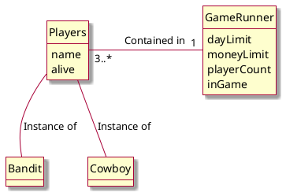
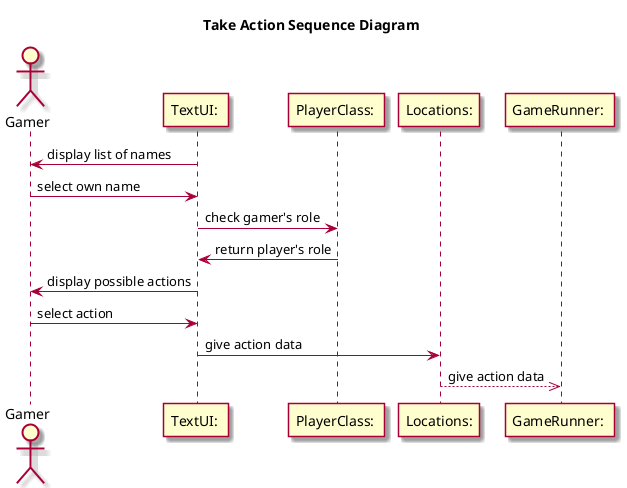
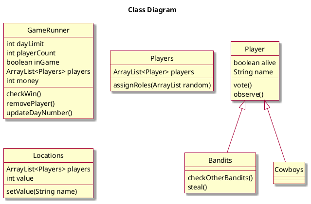
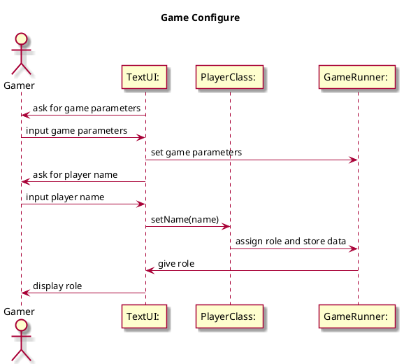
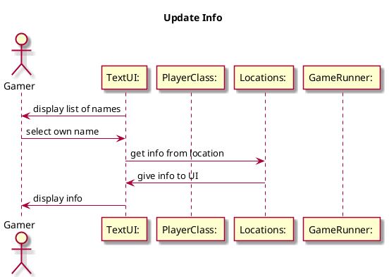

```plantuml


@startuml
hide circle
hide empty methods


skin rose
' classes


class GameRunner{
dayLimit
moneyLimit
playerCount
inGame
}


class Players{
name
alive
}


class Bandit{
}


class Cowboy{
}
' associations
Players "3..*" - "1" GameRunner : \tContained in\t
Players -down- Bandit : Instance of
Players -down- Cowboy : Instance of
```

```plantuml


@startuml


title Take Action Sequence Diagram
skin rose


actor Gamer as gamer
participant "TextUI: " as UI
participant "PlayerClass: " as player
participant "Locations:" as loc
participant "GameRunner: " as game


UI -> gamer : display list of names
gamer -> UI : select own name
UI -> player : check gamer's role
player -> UI : return player's role
UI -> gamer : display possible actions
gamer -> UI : select action
UI -> loc : give action data
loc -->> game : give action data
@enduml
```

```plantuml


@startuml


title Class Diagram
hide circle
hide empty methods


skin rose
' classes


class GameRunner{
int dayLimit
int playerCount
boolean inGame
ArrayList<Players> players
int money
--
checkWin()
removePlayer()
updateDayNumber()
}

class Players{
ArrayList<Player> players
--
assignRoles(ArrayList random)
}

class Player{
boolean alive
String name
--
vote()
observe()
}


class Bandits{
--
checkOtherBandits()
steal()
}


class Cowboys{
--
}


class Locations{
ArrayList<Players> players
int value
--
setValue(String name)
}


Player <|-- Bandits
Player <|-- Cowboys
@enduml
```

```plantuml
@startuml


title Game Configure


skin rose


actor Gamer as gamer
participant "TextUI: " as UI
participant "PlayerClass: " as player
participant "GameRunner: " as game


UI -> gamer : ask for game parameters
gamer -> UI : input game parameters
UI -> game : set game parameters
UI -> gamer : ask for player name
gamer -> UI : input player name
UI -> player : setName(name)
player -> game : assign role and store data
game -> UI : give role
UI -> gamer : display role
@enduml
```

```plantuml
@startuml


title Update Info


skin rose


actor Gamer as gamer
participant "TextUI: " as UI
participant "PlayerClass: " as player
participant "Locations: " as loc
participant "GameRunner: " as game


UI -> gamer : display list of names
gamer -> UI : select own name
UI -> loc : get info from location
loc -> UI : give info to UI
UI -> gamer : display info
@enduml
```

