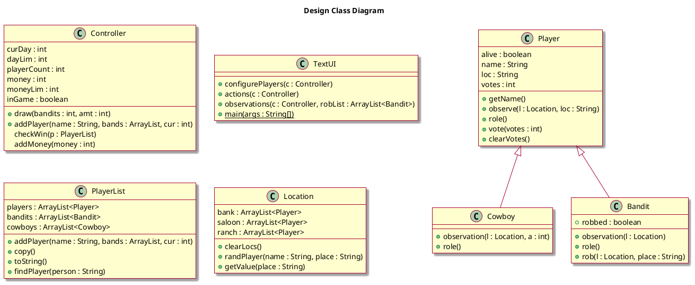
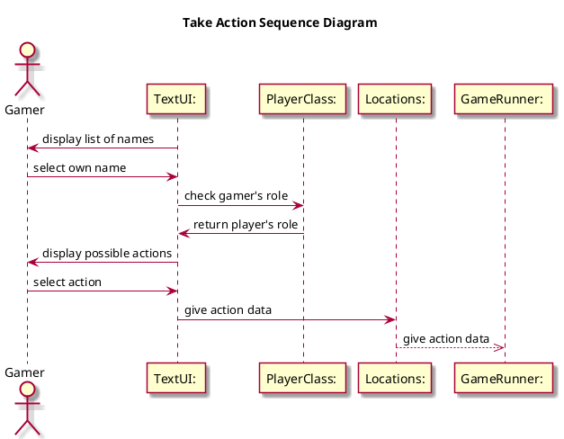
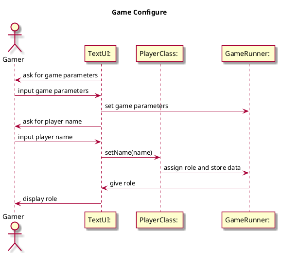
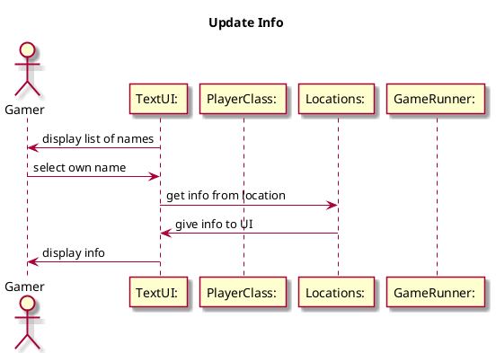

```plantuml


@startuml


title Design Class Diagram
hide empty methods


skin rose
' classes


class Controller{
curDay : int
dayLim : int
playerCount : int
money : int
moneyLim : int
inGame : boolean
--
+draw(bandits : int, amt : int)
+addPlayer(name : String, bands : ArrayList, cur : int)
checkWin(p : PlayerList)
addMoney(money : int)
}

class TextUI{
--
+configurePlayers(c : Controller)
+actions(c : Controller)
+observations(c : Controller, robList : ArrayList<Bandit>)
+main{static}(args : String[])
}

class Player{
alive : boolean
name : String
loc : String
votes : int
--
+getName()
+observe(l : Location, loc : String)
+role()
+vote(votes : int)
+clearVotes()
}

class Cowboy{
--
+observation(l : Location, a : int)
+role()
}

class Bandit{
+robbed : boolean
--
+observation(l : Location)
+role()
+rob(l : Location, place : String)
}

class PlayerList{
players : ArrayList<Player> 
bandits : ArrayList<Bandit>
cowboys : ArrayList<Cowboy>
--
+addPlayer(name : String, bands : ArrayList, cur : int)
+copy()
+toString()
+findPlayer(person : String)
}

class Location{
bank : ArrayList<Player>
saloon : ArrayList<Player>
ranch : ArrayList<Player>
--
+clearLocs()
+randPlayer(name : String, place : String)
+getValue(place : String)
}

Player <|-- Bandit
Player <|-- Cowboy
@enduml

```

```plantuml


@startuml


title Take Action Sequence Diagram
skin rose


actor Gamer as gamer
participant "TextUI: " as UI
participant "PlayerClass: " as player
participant "Locations:" as loc
participant "GameRunner: " as game


UI -> gamer : display list of names
gamer -> UI : select own name
UI -> player : check gamer's role
player -> UI : return player's role
UI -> gamer : display possible actions
gamer -> UI : select action
UI -> loc : give action data
loc -->> game : give action data
@enduml
```

```plantuml
@startuml


title Game Configure


skin rose


actor Gamer as gamer
participant "TextUI: " as UI
participant "PlayerClass: " as player
participant "GameRunner: " as game


UI -> gamer : ask for game parameters
gamer -> UI : input game parameters
UI -> game : set game parameters
UI -> gamer : ask for player name
gamer -> UI : input player name
UI -> player : setName(name)
player -> game : assign role and store data
game -> UI : give role
UI -> gamer : display role
@enduml
```

```plantuml
@startuml


title Update Info


skin rose


actor Gamer as gamer
participant "TextUI: " as UI
participant "PlayerClass: " as player
participant "Locations: " as loc
participant "GameRunner: " as game


UI -> gamer : display list of names
gamer -> UI : select own name
UI -> loc : get info from location
loc -> UI : give info to UI
UI -> gamer : display info
@enduml
```

