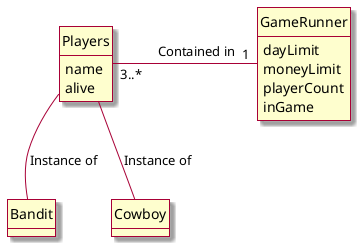
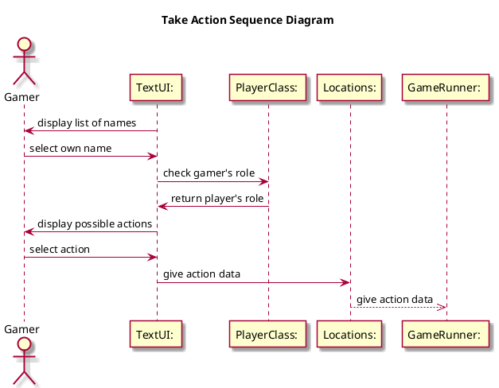
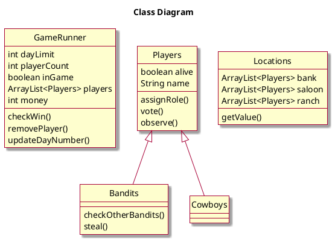

```plantuml

@startuml
hide circle
hide empty methods

skin rose
' classes

class GameRunner{
dayLimit
moneyLimit
playerCount
inGame
}

class Players{
name
alive
}

class Bandit{
}

class Cowboy{
}
' associations
Players "3..*" - "1" GameRunner : \tContained in\t
Players -down- Bandit : Instance of
Players -down- Cowboy : Instance of
```

```plantuml

@startuml

title Take Action Sequence Diagram
skin rose

actor Gamer as gamer
participant "TextUI: " as UI
participant "PlayerClass: " as player
participant "Locations:" as loc
participant "GameRunner: " as game

UI -> gamer : display list of names
gamer -> UI : select own name
UI -> player : check gamer's role
player -> UI : return player's role
UI -> gamer : display possible actions
gamer -> UI : select action
UI -> loc : give action data
loc -->> game : give action data
@enduml
```

```plantuml

@startuml

title Class Diagram
hide circle
hide empty methods

skin rose
' classes

class GameRunner{
int dayLimit
int playerCount
boolean inGame
ArrayList<Players> players
int money
--
checkWin()
removePlayer()
updateDayNumber()
}

class Players{
boolean alive
String name
--
assignRole()
vote()
observe()
}

class Bandits{
--
checkOtherBandits()
steal()
}

class Cowboys{
--
}

class Locations{
ArrayList<Players> bank
ArrayList<Players> saloon
ArrayList<Players> ranch
--
getValue()
}

Players <|-- Bandits
Players <|-- Cowboys
@enduml
```