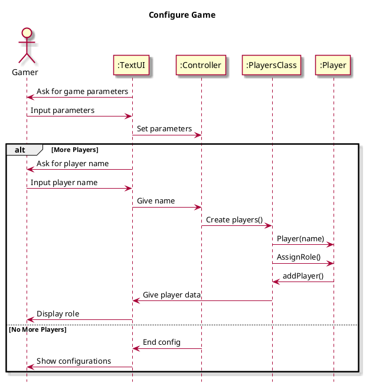
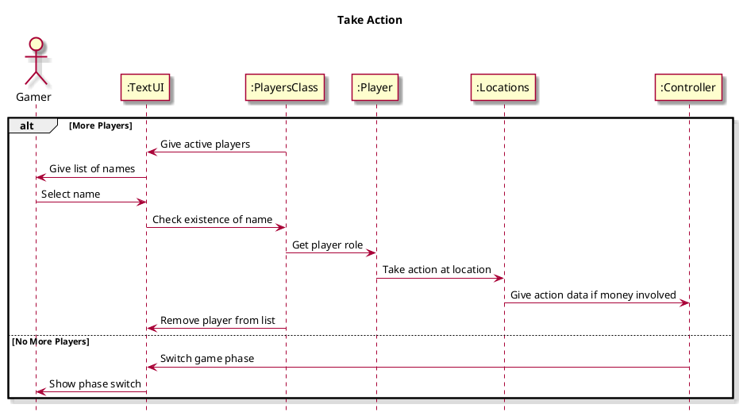
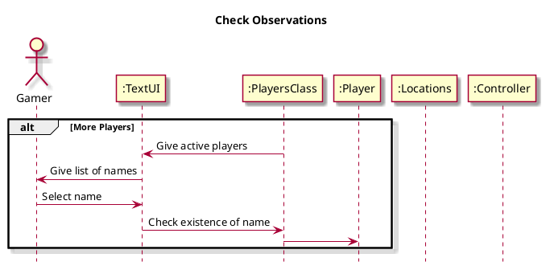
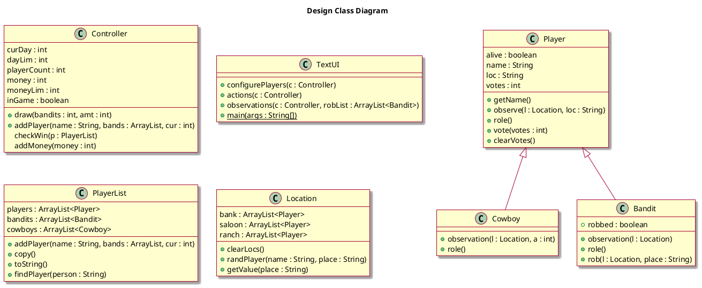

```plantuml
@startuml


title Configure Game
hide footbox
skin rose

actor Gamer as gamer
participant ":TextUI" as UI
participant ":Controller" as control
participant ":PlayersClass" as players
participant ":Player" as player

UI -> gamer: Ask for game parameters
gamer -> UI: Input parameters
UI -> control: Set parameters

alt More Players
UI -> gamer: Ask for player name
gamer -> UI: Input player name
UI -> control: Give name
control -> players: Create players()
players -> player: Player(name)
players -> player: AssignRole()
player -> players: addPlayer()
players -> UI: Give player data
UI -> gamer: Display role
else No More Players
control -> UI: End config
UI -> gamer: Show configurations
end
```

```plantuml
@startuml

title Take Action
hide footbox
skin rose

actor Gamer as gamer
participant ":TextUI" as UI
participant ":PlayersClass" as players
participant ":Player" as player
participant ":Locations" as loc
participant ":Controller" as control

alt More Players
players -> UI: Give active players
UI -> gamer: Give list of names
gamer -> UI: Select name
UI -> players: Check existence of name
players -> player: Get player role
player -> loc: Take action at location
loc -> control: Give action data if money involved
players -> UI: Remove player from list
else No More Players
control -> UI: Switch game phase
UI -> gamer: Show phase switch
end

```

```plantuml
@startuml

title Check Observations
hide footbox
skin rose

actor Gamer as gamer
participant ":TextUI" as UI
participant ":PlayersClass" as players
participant ":Player" as player
participant ":Locations" as loc
participant ":Controller" as control

alt More Players
players -> UI: Give active players
UI -> gamer: Give list of names
gamer -> UI: Select name
UI -> players: Check existence of name
players -> player: 
end

```

```plantuml


@startuml


title Design Class Diagram
hide empty methods


skin rose
' classes


class Controller{
curDay : int
dayLim : int
playerCount : int
money : int
moneyLim : int
inGame : boolean
--
+draw(bandits : int, amt : int)
+addPlayer(name : String, bands : ArrayList, cur : int)
checkWin(p : PlayerList)
addMoney(money : int)
}

class TextUI{
--
+configurePlayers(c : Controller)
+actions(c : Controller)
+observations(c : Controller, robList : ArrayList<Bandit>)
+main{static}(args : String[])
}

class Player{
alive : boolean
name : String
loc : String
votes : int
--
+getName()
+observe(l : Location, loc : String)
+role()
+vote(votes : int)
+clearVotes()
}

class Cowboy{
--
+observation(l : Location, a : int)
+role()
}

class Bandit{
+robbed : boolean
--
+observation(l : Location)
+role()
+rob(l : Location, place : String)
}

class PlayerList{
players : ArrayList<Player> 
bandits : ArrayList<Bandit>
cowboys : ArrayList<Cowboy>
--
+addPlayer(name : String, bands : ArrayList, cur : int)
+copy()
+toString()
+findPlayer(person : String)
}

class Location{
bank : ArrayList<Player>
saloon : ArrayList<Player>
ranch : ArrayList<Player>
--
+clearLocs()
+randPlayer(name : String, place : String)
+getValue(place : String)
}

Player <|-- Bandit
Player <|-- Cowboy
@enduml

```
