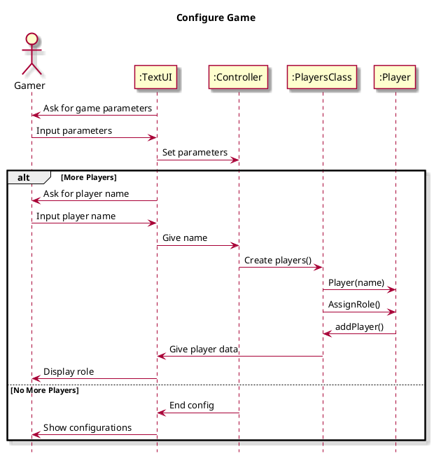
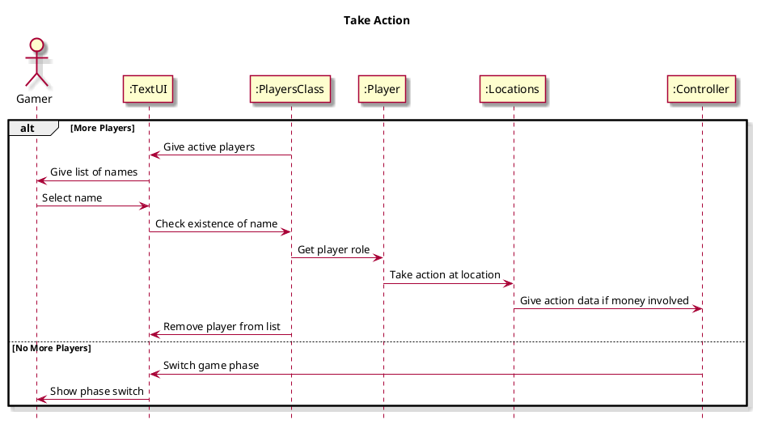
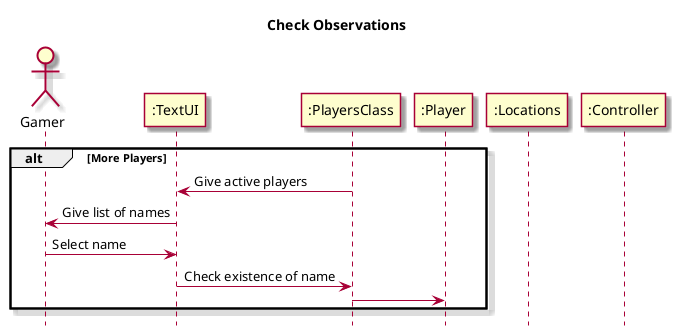
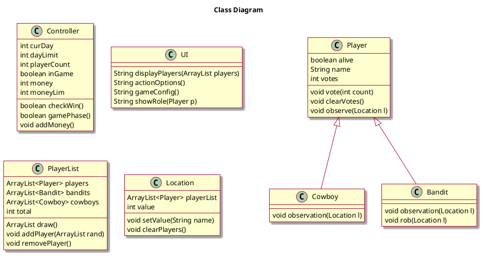

```plantuml
@startuml


title Configure Game
hide footbox
skin rose

actor Gamer as gamer
participant ":TextUI" as UI
participant ":Controller" as control
participant ":PlayersClass" as players
participant ":Player" as player

UI -> gamer: Ask for game parameters
gamer -> UI: Input parameters
UI -> control: Set parameters

alt More Players
UI -> gamer: Ask for player name
gamer -> UI: Input player name
UI -> control: Give name
control -> players: Create players()
players -> player: Player(name)
players -> player: AssignRole()
player -> players: addPlayer()
players -> UI: Give player data
UI -> gamer: Display role
else No More Players
control -> UI: End config
UI -> gamer: Show configurations
end
```

```plantuml
@startuml

title Take Action
hide footbox
skin rose

actor Gamer as gamer
participant ":TextUI" as UI
participant ":PlayersClass" as players
participant ":Player" as player
participant ":Locations" as loc
participant ":Controller" as control

alt More Players
players -> UI: Give active players
UI -> gamer: Give list of names
gamer -> UI: Select name
UI -> players: Check existence of name
players -> player: Get player role
player -> loc: Take action at location
loc -> control: Give action data if money involved
players -> UI: Remove player from list
else No More Players
control -> UI: Switch game phase
UI -> gamer: Show phase switch
end

```

```plantuml
@startuml

title Check Observations
hide footbox
skin rose

actor Gamer as gamer
participant ":TextUI" as UI
participant ":PlayersClass" as players
participant ":Player" as player
participant ":Locations" as loc
participant ":Controller" as control

alt More Players
players -> UI: Give active players
UI -> gamer: Give list of names
gamer -> UI: Select name
UI -> players: Check existence of name
players -> player: 
end

```

```plantuml


@startuml


title Class Diagram
hide empty methods


skin rose
' classes


class Controller{
int curDay
int dayLimit
int playerCount
boolean inGame
int money
int moneyLim
--
boolean checkWin()
boolean gamePhase()
void addMoney()
}

class UI{
--
String displayPlayers(ArrayList players)
String actionOptions()
String gameConfig()
String showRole(Player p)
}

class Player{
boolean alive
String name
int votes
--
void vote(int count)
void clearVotes()
void observe(Location l)
}

class Cowboy{
--
void observation(Location l)
}

class Bandit{
--
void observation(Location l)
void rob(Location l)
}

class PlayerList{
ArrayList<Player> players
ArrayList<Bandit> bandits
ArrayList<Cowboy> cowboys
int total
--
ArrayList draw()
void addPlayer(ArrayList rand)
void removePlayer()
}

class Location{
ArrayList<Player> playerList
int value
--
void setValue(String name)
void clearPlayers()
}

Player <|-- Bandit
Player <|-- Cowboy
@enduml

```
