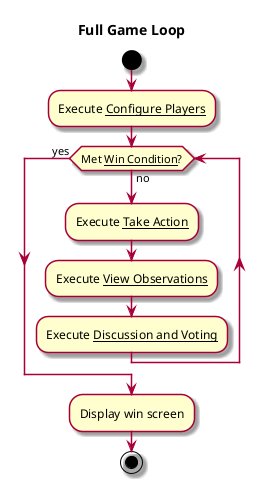
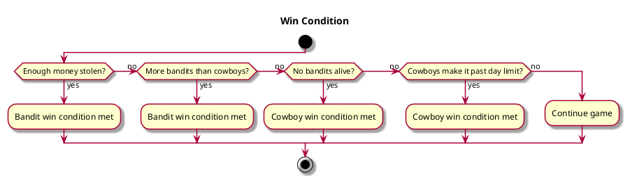

**Level**: User Goal

**Primary Actor**: Players

**Stakeholders and Interests**:
- Players want to play and win at the game
  - Bandits want to either get enough money or have control over the town
  - Cowboys want to hold out till sheriffs come or remove all the bandits from the town

**Preconditions**
- Players set up the game in a fair way
- Players make choices that help their team to win the game
- Players do not cheat at the game

**Postconditions**
- Game will fully run through
- One team will win

**Usability**
- Game flow is made clear
- Text is easily readable
- Game gives confirmation that players have done something

**Performance**
- Game responds quickly to inputs and screen switches
- Game can end at any time
- Game can be closed and continue running

**Supportability**
- Flexibility to add more ways of winning
- Flexibility to add more game phases