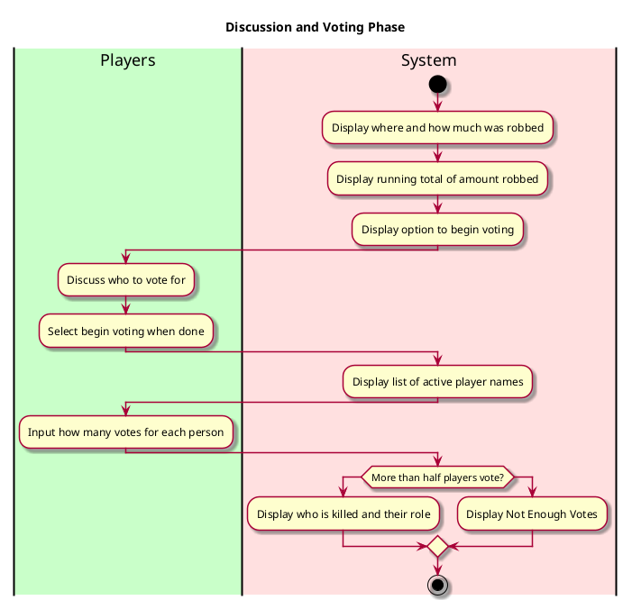
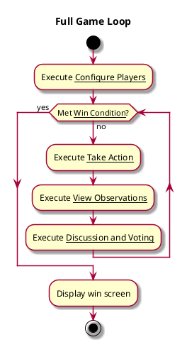
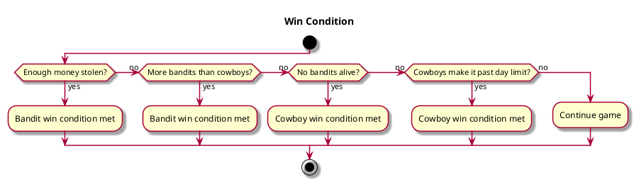

```plantuml
@startuml
title Discussion and Voting Phase

skin rose
'define swimlanes
|#technology|Players|
|#implementation|System|

|System|
start
:Display where and how much was robbed;
:Display running total of amount robbed;
:Display option to begin voting;
|Players|
:Discuss who to vote for;
:Select begin voting when done;
|System|
:Display list of active player names;
|Players|
:Input how many votes for each person;
|System|
if (More than half players vote?) then
|System|
:Display who is killed and their role;
else
|System|
:Display Not Enough Votes;
endif
stop
@enduml

@enduml
```

``` plantuml
@startuml
skin rose
title Full Game Loop

start
:Execute __Configure Players__;
while (Met __Win Condition__?) is (no)
:Execute __Take Action__;
:Execute __View Observations__;
:Execute __Discussion and Voting__;
endwhile (yes)
:Display win screen;
stop
```

```plantuml
@startuml
skin rose
title Win Condition

start
if (Enough money stolen?) is (yes) then
:Bandit win condition met;
(no) elseif (More bandits than cowboys?) then (yes)
:Bandit win condition met;
(no) elseif (No bandits alive?) then (yes)
:Cowboy win condition met;
(no) elseif (Cowboys make it past day limit?) then (yes)
:Cowboy win condition met;
else (no)
:Continue game;
endif
stop
@enduml
```