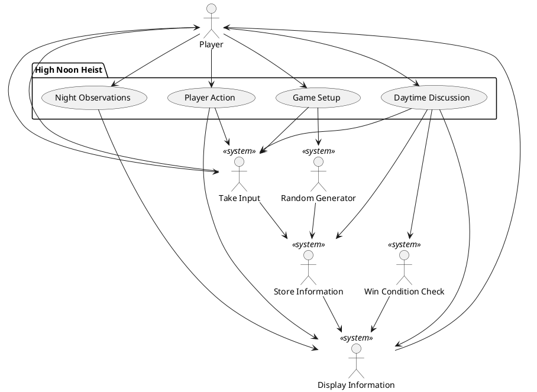

**Introduction**:   
We are creating a Social Deduction game based in the Wild West, by the name of "High Noon Heist". 
The Bandits win by stealing enough money from the town before the sheriff arrives or having a majority. 
The Cowboys win by voting out the Bandits or keeping the money safe until the sheriff arrives. 
It only requires one smartphone or tablet to be passed around among a friend group for a fun time!

**Business Case**:
- It is a unique spin on social deduction games, with customization options and easy access. 
- Great for a group of friends looking to have fun together!

**Key Functionality**:
- Take player inputs.
- Random generation. (In the use of deciding what roles players are and what the "Bandits" get to see during the night).
- Storing information into the system. (Such as player roles, day count, money stolen, etc.)
- Displaying information integral to the game to the players.

**Constraints**:

Requires exactly one smartphone/tablet. One is needed to run the game, and it cannot allow for playing across more devices.

**Stakeholder goals summary**:

Primary actors: 

- **The players**: Give inputs to the game. Be able to see information related to the game.

Supporting actors:

- **Input Scanner**: Receives inputs from the player and relays it to the system.

- **Random Generator**: Generate player type (Bandit or Cowboy) for each player during game setup. Determine what Bandits get to see during the night at the game setup.

- **Information Display**: Display information integral to the game to the player.

- **Information Storage**: Store Information that is generated by the system or inputted by the player.

- **Win Condition Check**: Checks if a team has won the game.

