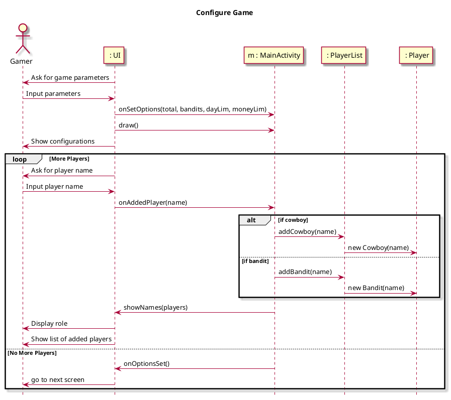
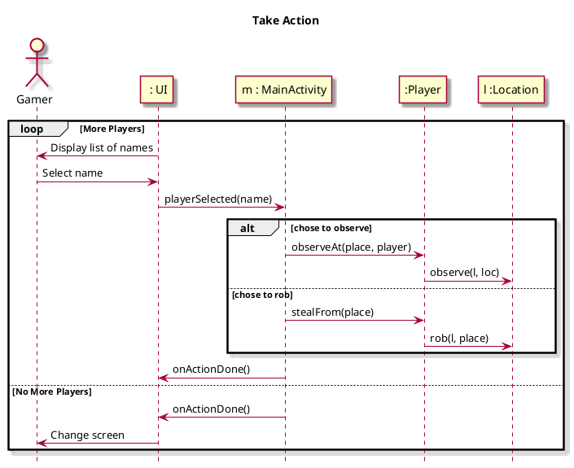
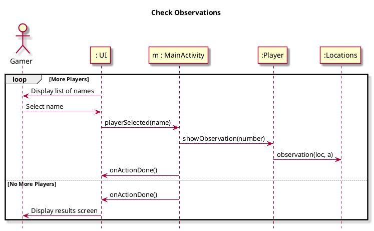
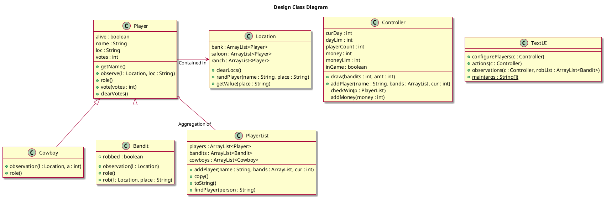

```plantuml
@startuml


title Configure Game
hide footbox
skin rose

actor Gamer as gamer
participant " : UI" as UI
participant "m : MainActivity" as main
participant " : PlayerList" as players
participant " : Player" as player

UI -> gamer: Ask for game parameters
gamer -> UI: Input parameters
UI -> main: onSetOptions(total, bandits, dayLim, moneyLim)
UI -> main: draw()
UI -> gamer: Show configurations

loop More Players
UI -> gamer: Ask for player name
gamer -> UI: Input player name
UI -> main : onAddedPlayer(name)
alt if cowboy
main -> players : addCowboy(name)
players -> player : new Cowboy(name)
else if bandit
main -> players : addBandit(name)
players -> player : new Bandit(name)
end
main -> UI : showNames(players)
UI -> gamer: Display role
UI -> gamer : Show list of added players
else No More Players
main -> UI : onOptionsSet()
UI -> gamer : go to next screen
end
```

```plantuml
@startuml

title Take Action
hide footbox
skin rose

actor Gamer as gamer
participant " : UI" as UI
participant "m : MainActivity" as main
participant ":Player" as player
participant "l :Location" as loc


loop More Players
UI -> gamer: Display list of names
gamer -> UI: Select name
UI -> main : playerSelected(name)
alt chose to observe
main -> player : observeAt(place, player)
player -> loc : observe(l, loc)
else chose to rob
main -> player : stealFrom(place)
player -> loc : rob(l, place)
end
main -> UI : onActionDone()
else No More Players
main -> UI: onActionDone()
UI -> gamer: Change screen
end
```

```plantuml
@startuml

title Check Observations
hide footbox
skin rose

actor Gamer as gamer
participant " : UI" as UI
participant "m : MainActivity" as main
participant ":Player" as player
participant ":Locations" as loc

loop More Players
UI -> gamer: Display list of names
gamer -> UI: Select name
UI -> main : playerSelected(name)
main -> player : showObservation(number)
player -> loc : observation(loc, a)
main -> UI : onActionDone()
else No More Players
main -> UI : onActionDone()
UI -> gamer : Display results screen
end
```

```plantuml


@startuml


title Design Class Diagram
hide empty methods


skin rose
' classes


class Controller{
curDay : int
dayLim : int
playerCount : int
money : int
moneyLim : int
inGame : boolean
--
+draw(bandits : int, amt : int)
+addPlayer(name : String, bands : ArrayList, cur : int)
checkWin(p : PlayerList)
addMoney(money : int)
}

class TextUI{
--
+configurePlayers(c : Controller)
+actions(c : Controller)
+observations(c : Controller, robList : ArrayList<Bandit>)
+main{static}(args : String[])
}

class Player{
alive : boolean
name : String
loc : String
votes : int
--
+getName()
+observe(l : Location, loc : String)
+role()
+vote(votes : int)
+clearVotes()
}

class Cowboy{
--
+observation(l : Location, a : int)
+role()
}

class Bandit{
+robbed : boolean
--
+observation(l : Location)
+role()
+rob(l : Location, place : String)
}

class PlayerList{
players : ArrayList<Player> 
bandits : ArrayList<Bandit>
cowboys : ArrayList<Cowboy>
--
+addPlayer(name : String, bands : ArrayList, cur : int)
+copy()
+toString()
+findPlayer(person : String)
}

class Location{
bank : ArrayList<Player>
saloon : ArrayList<Player>
ranch : ArrayList<Player>
--
+clearLocs()
+randPlayer(name : String, place : String)
+getValue(place : String)
}

Player o-- "Aggregation of" PlayerList: \t\t
Player -> "Contained in" Location: \t\t
Player <|-- Bandit
Player <|-- Cowboy
@enduml
```
