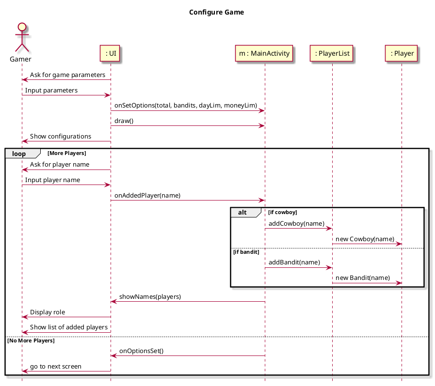
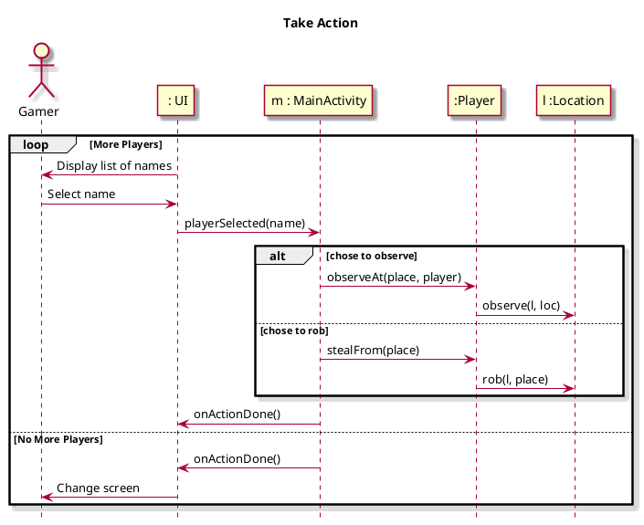
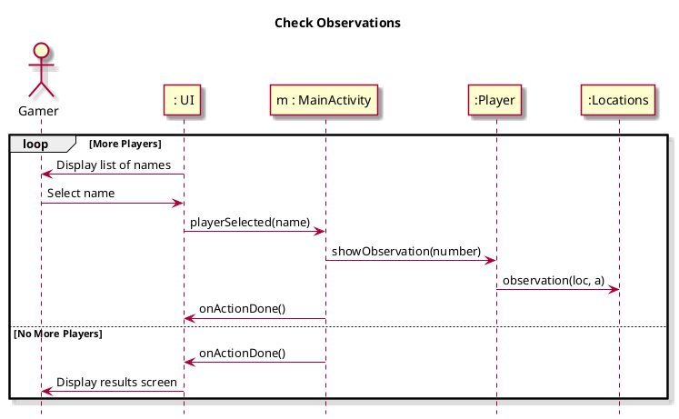

```plantuml

title Design Class Diagram
skin rose

hide empty methods

class MainActivity{
curDay : int
dayLim : int
gamePhase: int
curMoney : int
moneyLim : int
playerCount : int
banditCount : int
playersList : PlayerList
banditVals : List
current : Player
canAct : PlayerList
loc : Location
mainView : IMainView
--
+onCreate
+getPlayerListCopy()
+getMoney()
+checkPlayerCap()
+onPlayersSet
+findPlayer(name : String)
+draw()
+onSetOptions()
+onOptionsSet()
+onAddedPlayer()
+showRole()
+setCurrentPlayer(current : Player)
+toString()
+getPlayers()
+playerSelected(name : String)
+checkPhase()
+onActionDone()
+observeAt(place : String, player : Player)
+stealFrom(place : String)
+checkWin()
}

Class Player{
alive : boolean
name : String
loc : String
votes : int
--
+Player(name : String)
+getName()
+observe(l: Location, loc : String)
+role()
+vote(votes : int)
+clearVotes()
+viewLoc()
+observation(loc : Location, a : int)
+rob(l : Location, place : String)
+displayRole()
}

class Bandit{
robbed : boolean
--
+role()
+observation(l : Location, a : int)
+displayRole()
+rob(l : Location, place : String)
}

class Cowboy{
--
+observation(l : Location, a : int)
+role()
+displayRole()
}

class PlayerList{
players : ArrayList<Player> 
bandits : ArrayList<Bandit>
cowboys : ArrayList<Cowboy>
--
+addPlayer(name : String, bands : ArrayList, cur : int)
+addCowboy(name : String)
+addBandit(name : String)
+copyPlayers()
+toString()
+findPlayer(person : String)
+removePlayer(p : Player)
}

class Location{
bank : ArrayList<Player>
saloon : ArrayList<Player>
ranch : ArrayList<Player>
--
+clearLocs()
+randPlayer(name : String, place : String)
+getValue(place : String)
}

class ConfigGameFragment{
binding : FragmentConfigGameBinding
listener : Listener
--
+ConfigGameFragment()
+ConfigGameFragment(listener : Listener)
+onCreateView(inflater : LayoutInflater, container : ViewGroup, savedInstanceState : Bundle)
+onViewCreated(view : View, savedInstanceState : Bundle)
+showConfig(m : MainActivity)
}

class AddPlayersFragment{
binding : FragmentAddPlayersBinding
listener : Listener
--
+AddPlayersFragment()
+AddPlayersFragment(listener : Listener)
+onCreateView(inflater : LayoutInflater, container : ViewGroup, savedInstanceState : Bundle)
+onViewCreated(view : View, savedInstanceState : Bundle)
+showName(players : PlayerList)
+showRole(main : MainActivity)
+clearRole(players : PlayerList)
}

class PlayerListActionFragment{
binding : FragmentPlayerListActionBinding
listener : Listener
activePlayers : PlayerList
--
+PlayerListActionFragment()
+PlayerListActionFragment(listener : Listener, activePlayers : PlayerList)
+onCreateView(inflater : LayoutInflater, container : ViewGroup, savedInstanceState : Bundle)
+onViewCreated(view : View, savedInstanceState : Bundle)
}

class ActionSelectFragment{
binding : FragmentActionSelectBinding
listener : Listener
active : Player
--
+ActionSelectFragment()
+ActionSelectFragment(active : Player, listener : Listener)
+onCreateView(inflater : LayoutInflater, container : ViewGroup, savedInstanceState : Bundle)
+onViewCreated(view : View, savedInstanceState : Bundle)
+generalObserveButton(place : String)
+generalStealButton(place : String)
+addConfirm()
+cowboyAction()
+banditAction()
}

class viewObservationFragment{
binding : FragmentViewObservationBinding
listener : Listener
current : Player
--
+viewObservationFragment()
+viewObservationFragment(listener : Listener, current : Player)
+onCreateView(inflater : LayoutInflater, container : ViewGroup, savedInstanceState : Bundle)
+onViewCreated(view : View, savedInstanceState : Bundle)
+cowboyObservation()
+banditObservation()
+addConfirm()
}

Player o-- "Aggregation of" PlayerList: \t\t
Player -> "Contained in" Location: \t\t
Player <|-- Bandit
Player <|-- Cowboy

```
