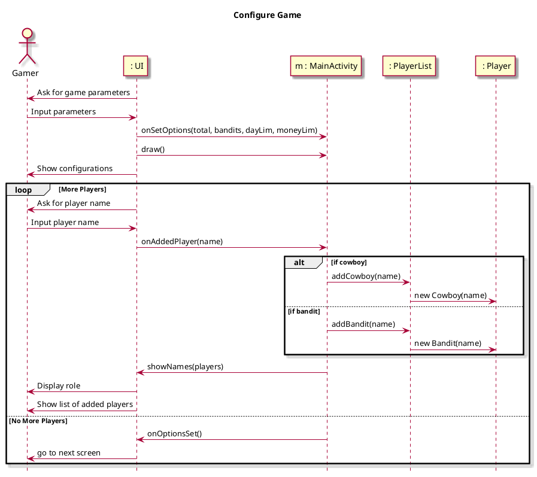
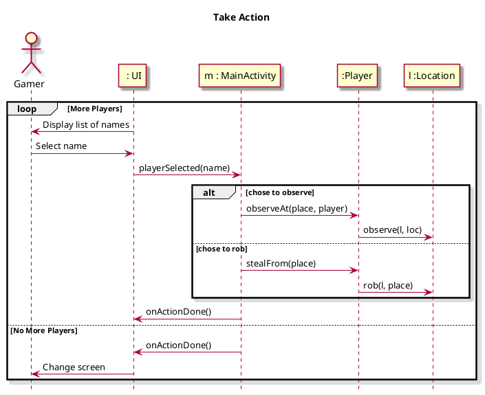
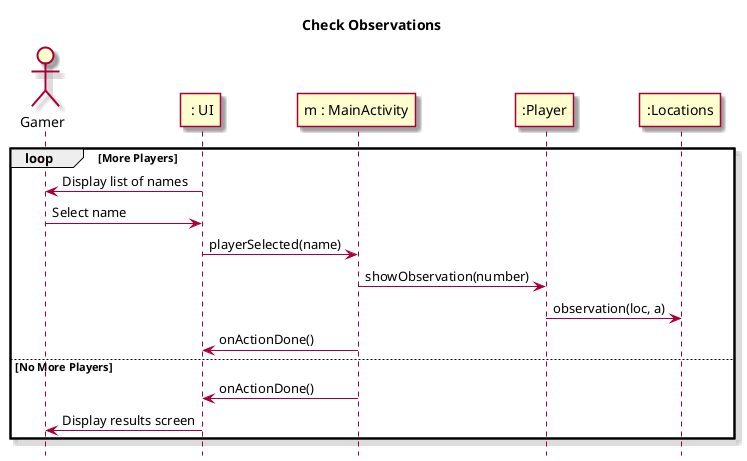
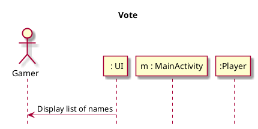
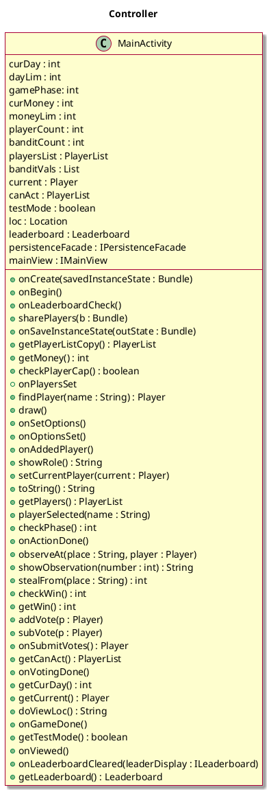
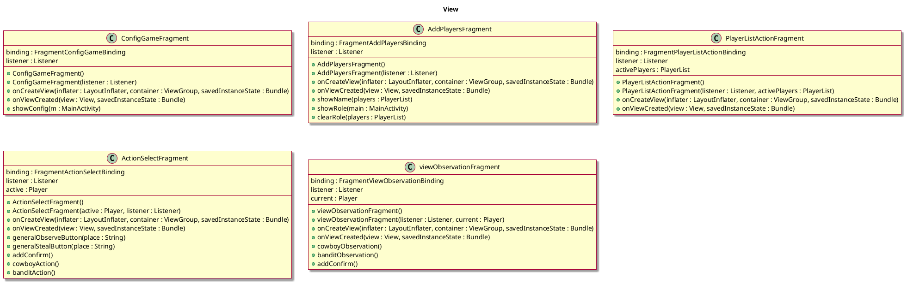

```plantuml

title Model Classes
skin rose

hide empty methods

Class Player{
name : String
loc : String
votes : int
--
+Player(name : String)
+getName() : String
+observe(l: Location, loc : String)
+role() : int
+vote(votes : int)
+resetVotes()
+viewLoc() : String
+getVotes() : int
+observation(loc : Location, a : int)
+rob(l : Location, place : String)
+displayRole() : String
+addVote()
+subVote()
{static} +fromBundle(b : Bundle)
+checkBundleRole(b : Bundle) : boolean
}

class Bandit{
robbed : boolean
--
+role() : int
+observation(l : Location, a : int) : String
+displayRole() : String
+rob(l : Location, place : String) : int
+toBundle() : Bundle
{static} + fromBundle(b : Bundle) : Bandit
}

class Cowboy{
--
+observation(l : Location, a : int) : String
+role() : int
+displayRole() : String
+toBundle() : Bundle
{static} +fromBundle(b : Bundle) : Cowboy
}

class PlayerList{
players : ArrayList<Player> 
bandits : ArrayList<Bandit>
cowboys : ArrayList<Cowboy>
--
+addCowboy(name : String)
+addBandit(name : String)
+copyPlayers() : PlayerList
+toString() : String
+findPlayer(person : String) : Player
+removePlayer(p : Player)
+voteVals() : int[]
+tallyVotes() : int
+mostVotes() : Player
+checkTie() : boolean
+canRemove() : boolean
+toBundle() : Bundle
{static} +fromBundle(b : Bundle) : PlayerList
}

class Location{
bank : ArrayList<Player>
saloon : ArrayList<Player>
ranch : ArrayList<Player>
--
+clearLocs()
+randPlayer(name : String, place : String) : Player
+getValue(place : String) : int
+addTo(p : Player, place : String)
+inLocation(name : String) : String
+toBundle() : Bundle
{static} +fromBundle(b : Bundle) : Location
}

class Winner{
banditWin : boolean = false
cowboyWin : boolean = false
date : String
winDate : Date
--
+setBanditWin()
+setCowboyWin()
+toString() : String
+toBundle() : Bundle
{static} +fromBundle(b : Bundle) : Winner
}

Player o-- "Aggregation of" PlayerList: \t\t
Player -> "Contained in" Location: \t\t
Player <|-- Bandit
Player <|-- Cowboy

```


