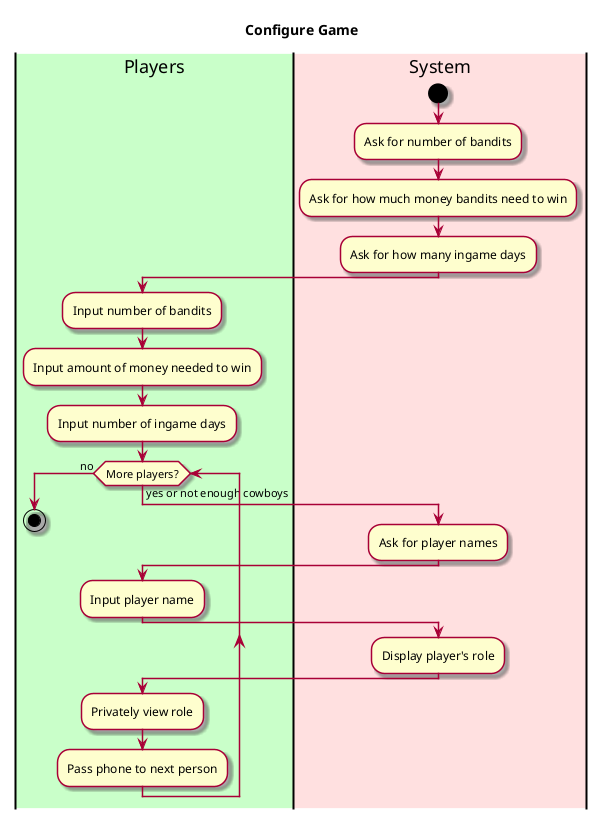

Social Deduction Game - Configure Game

**Level**: User Goal

**Primary Actor**: Players

**Stakeholders and Interests**:
- Players want to set up the game based on their number of players
Want to know what role they'll be given for the game, and how to change their play styles based on it. 

**Preconditions**
- Player does not share the screen with others
- Player passes the phone when they're done adding themselves

**Postconditions**
- Players are given roles
- Number of bandits and cowboys are configured

**Non-functional requirements**

Usability
- Text should be well visible. No ability to review roles to keep secrecy

Performance
- Responds to inputs and switches screen in a timely manner

Supportability
- Game allows for any number of players greater than 2
- Allows for any number of bandits as long as it's not half the players or more
- Players have control over win difficulty
- Players have control over how long the game goes
