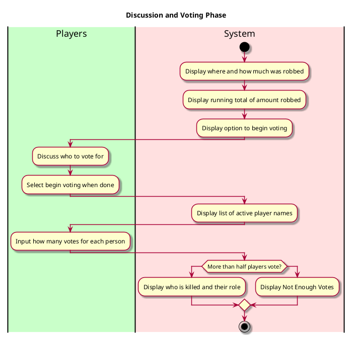

Social Deduction Game - Discuss and Vote

**Level**: User Goal

**Primary Actor**: Players

**Stakeholders and Interests**:
- Players want to vote out other players to progress the game
  - Cowboys want to vote out the Bandits to stop them from stealing and thus winning the game
  - Bandits want to vote out the Cowboys to gain the majority

**Preconditions**
- Players have discussed the information they have been given before moving to voting
- Player does not share the screen with others
- Player passes the phone when they're done voting

**Postconditions**
- The vote fails to pass and nothing happens or a vote passes and a player is removed from the game

**Non-functional requirements**

Usability
- UI should be well organized enough that players should easily be able to select who they vote for
- Confirmation that a player has voted
- Players should only be able to vote once per voting phase

Performance
- Responds to inputs in a timely manner

Supportability
- Have the ability to keep votes anonymous
