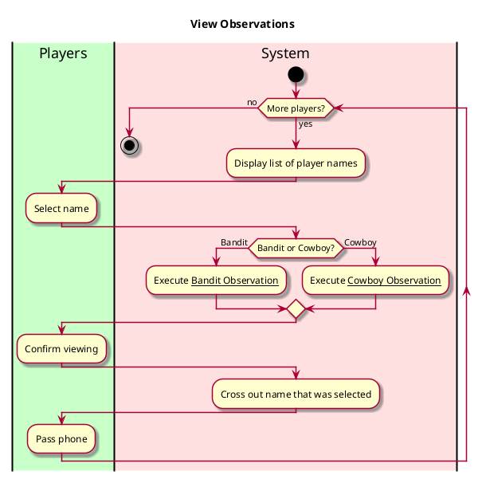
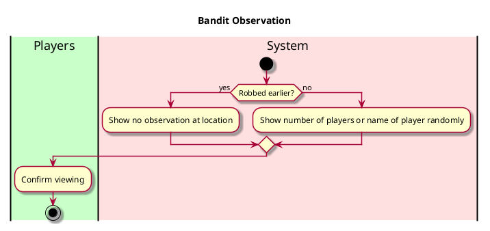
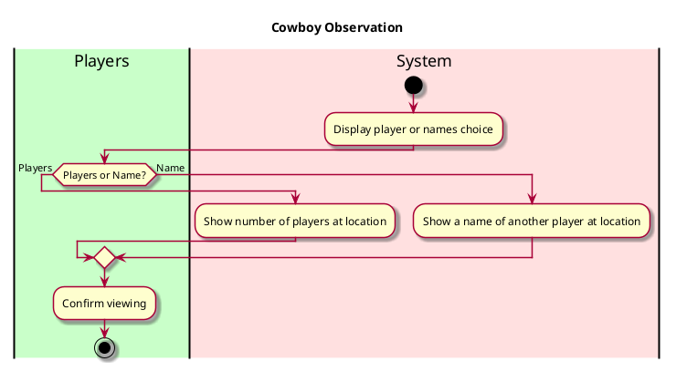

**Level**: User goal

**Primary Actor**: Players

**Stakeholders and Interests**
- Players want to be given information about what's happening in the game
  - Cowboys want information that helps them figure out who the bandits are
  - Bandits want information that helps them blend in with the cowboys

**Preconditions**
- Player has taken an action earlier
- Player does not share the screen with others
- Player passes the phone after they view their information

**Postconditions**
- Players are given information from the location they're at that helps them get to their goal

**Usability**
- Text should be well visible
- No ability to view observations again after they're seen

**Performance**
- Displays information almost immediately

**Supportability**
- Ability to change or add more things a player can see