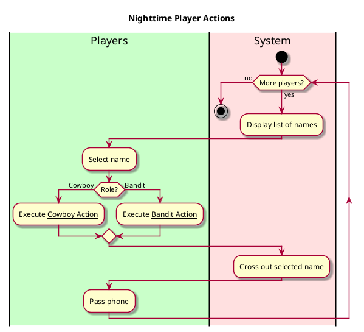
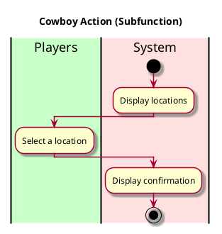
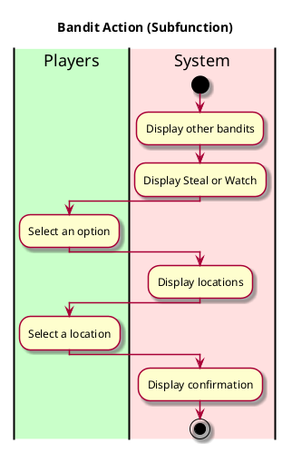

**Level**: User goal

**Primary Actor**: Players

**Stakeholders and Interests**
- Players want to take an action that gets them closer to their win condition
  - Bandits want to steal money from a place or blend in with cowboys
  - Cowboys want to watch over a place to uncover who the bandits are

**Preconditions**
- Players do not share their actions with others

**Postconditions**
- Players do something that puts them closer to winning the game

**Non-functional Requirements**
Usability
- Buttons are well visible and easy to understand
- Confirmation that an action has been taken
- Game disallows more than one action per player

Performance
- Game gives confirmation almost instantly that an action has been done

Supportability
- Flexbility to add more actions in the future

